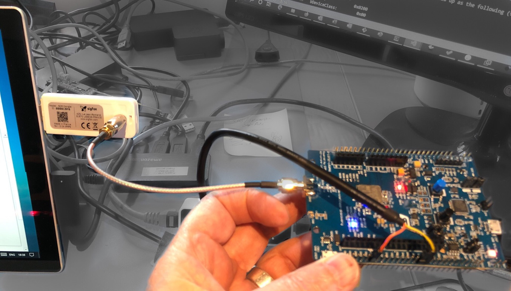
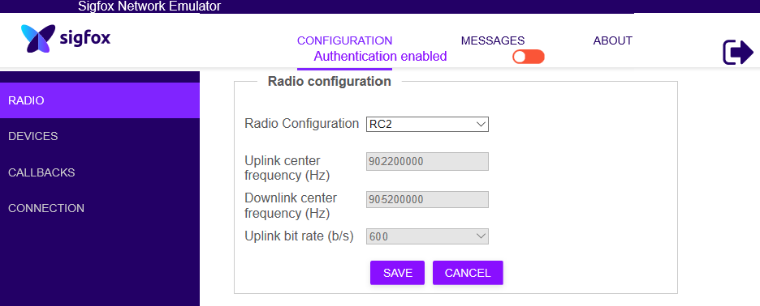
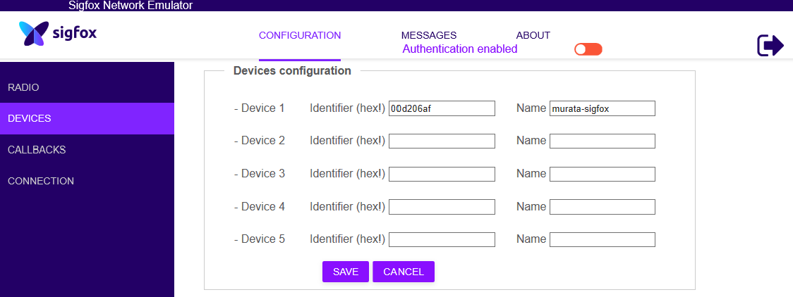
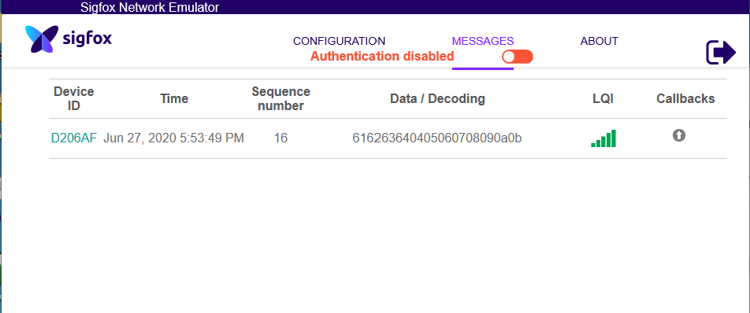

# Step-by-step log of Sigfox Bring-up

This documents work done to bring up a Sigfox node based on a Murata module, using the Disk91 repostories. Then we will migrate the code to an Arduino environment in order to support the MCCI Catena family of IOT products.

<!--
  This TOC uses the VS Code markdown TOC extension AlanWalk.markdown-toc.
  We strongly recommend updating using VS Code, the markdown-toc extension and the
  bierner.markdown-preview-github-styles extension. Note that if you are using
  VS Code 1.29 and Markdown TOC 1.5.6, https://github.com/AlanWalk/markdown-toc/issues/65
  applies -- you must change your line-ending to some non-auto value in Settings>
  Text Editor>Files.  `\n` works for me.
-->
<!-- markdownlint-disable MD033 MD004 -->
<!-- markdownlint-capture -->
<!-- markdownlint-disable -->
<!-- TOC depthFrom:2 updateOnSave:true -->

- [Current Status](#current-status)
- [Required materials](#required-materials)
- [Required Installations](#required-installations)
        - [Source code](#source-code)
        - [Ac6 build system](#ac6-build-system)
        - [Importing the Projects](#importing-the-projects)
- [Modify hardware](#modify-hardware)
- [Build the project](#build-the-project)
- [Downloading](#downloading)
- [Quick overview of the app](#quick-overview-of-the-app)
- [Connecting UARTS](#connecting-uarts)
        - [UART1](#uart1)
        - [UART2](#uart2)
- [Testing](#testing)
- [Configuring for US](#configuring-for-us)
- [Ordering credentials](#ordering-credentials)
        - [Creating a Product](#creating-a-product)
        - [Ordering Credentials](#ordering-credentials)
        - [Decrypting Credentials](#decrypting-credentials)
- [Testing with the SDR adapter](#testing-with-the-sdr-adapter)
        - [Sigfox SDR Adapter USB Descriptors](#sigfox-sdr-adapter-usb-descriptors)
        - [Connecting the SDR adapter to the B-L072Z-LRWAN1](#connecting-the-sdr-adapter-to-the-b-l072z-lrwan1)
        - [Making SNE Work](#making-sne-work)
- [References](#references)

<!-- /TOC -->
<!-- markdownlint-restore -->
<!-- Due to a bug in Markdown TOC, the table is formatted incorrectly if tab indentation is set other than 4. Due to another bug, this comment must be *after* the TOC entry. -->

## Current Status

We have successfully connected an ST [B-L072Z-LRWAN1][B-L072Z-LRWAN1] to the [Sigfox Network Emulator][SNE] (SNE) using the [Sigfox SDR adapter][2]. We're waiting for credentials

## Required materials

- STM32 LoRa Discovery Kit [B-L072Z-LRWAN1][B-L072Z-LRWAN1]

- SMA antenna for above for 915 MHz (as we're in the US)

- Sigfox RF test kit ([SDR adapter][2])

- Sigfox [Access Station Micro](https://support.sigfox.com/products#micro) (once we have credentials)

## Required Installations

### Source code

Make a directory (I chose `c:/mcci/projects/shetland/s`) and clone the following repositories into the directory.

- `git@github.com:disk91/itsdk-example-murata-lora.git` or https://github.com/disk91/itsdk-example-murata-lora
- `git@github.com:disk91/itsdk-example-sigfox-sx1276.git` or https://github.com/disk91/itsdk-example-sigfox-sx1276
- `git@github.com:disk91/stm32-it-sdk.git` or https://github.com/disk91/stm32-it-sdk

### Ac6 build system

- login and register at https://www.openstm32.org

- Download the IDE -- at time of writing, this was [here](https://www.openstm32.org/Downloading+the+System+Workbench+for+STM32+installer).

- Install it. I installed in my compressed `c:/tools` directory as `c:/tools/ac6`. It will show up in your Win10 menus as <image src="assets/ac6-menu-item-win10.png" alt="System Workbench for STM32" width="200px" height="42px" align="middle">.

- Open it up (it's Eclipse, be patient).

- It will prompt with this:

   <image src="assets/Eclipse-start.png" alt="Eclipse startup screen" width="500px">

   I accepted the default; you have to remember this, as this is where your projects get placed.

### Importing the Projects

Follow the instructions in the video https://www.youtube.com/watch?v=VEWrr4t8ujo -- it's got some errors, and if you use the[ Murata LoRa project](https://github.com/disk91/itsdk-example-murata-lora) used in the video, you'll find it hasn't been updated for version 1.5 of the IT SDK.

- https://youtu.be/VEWrr4t8ujo?t=107 shows how to import the projects. File>Import>Existing Projects into Workspace, and point to your example directory from above.

- You need to link the project to the SDK, which you do by [expanding the project in the project explorer](https://youtu.be/VEWrr4t8ujo?t=137 ). Right click on the project top-level; then `New>Folder`, `Advanced>>`, `[x] Link to alternate location`, and select your `stm32-it-sdk` directory.

  **Very important:** his example repositories already have links to an SDK, but they're wrong. So you have to delete them and re-add them. There are two places this must be done.

  **Very important:** you must work with the release configuration, but the default configuration is debug.

  Adding the source files:

  - Right click the project, then `Properties>C/C++ General/Paths and Symbols`. Select the `Source Location` tab on the right panel.
  - select Release configuration.
  - delete the old stm32sk src link; it will be the third or fourth line.
  - click `Add Folder...`
  - expand `stm32-it-sdk` and add `src`.
  - **Don't click apply yet**.

  Adding the include files:

  - Select `Properties>C/C++ Build>Settings`
  - Select `Tool Settings` tab
  - Select `MCU GCC Compiler>Includes`.
  - Again, remove the old copy of the `stm32 sdk/inc` entry, as it's for his system not yours (select it, and then press the icon with the red 'x' right above).
  - Now add a new link to your imported SDK, using the icon with the green '+' right above, and select the SDK `inc` directory.

- Then apply and say OK.

- Change the configuration to `Release`.

The other information in the video, although interesting, is not relevant to this project.

## Modify hardware

Refer to https://github.com/aureleq/muRataSigfox.

- Move JP9
- short SB13
- short SB26


## Build the project

After changing the configuration to `Release`, build the project.

You'll get several warnings. You can select the `Console` tab to watch progress. At the end, I got:

```console
Building target: murata-sigfox.elf
Invoking: MCU GCC Linker
arm-none-eabi-gcc -mcpu=cortex-m0plus -mthumb -mfloat-abi=soft -L"C:\Users\tmm\workspace\murata-sigfox\Drivers\LIBS" -specs=nosys.specs -specs=nano.specs -T"../STM32L072CZYx_FLASH.ld" -Wl,-Map=output.map -Wl,--gc-sections -o "murata-sigfox.elf" @"objects.list"  -lSgfxCoreV231_CM0_GCC -lSgfxSTModemSx1276V123_CM0_GCC -lSgfxAddonV020_CM0_GCC -lSgfxCmacV100_CM0_GCC -lm
Finished building target: murata-sigfox.elf

make --no-print-directory post-build
Generating hex and Printing size information:
arm-none-eabi-objcopy -O binary "murata-sigfox.elf" "murata-sigfox.bin"
arm-none-eabi-size "murata-sigfox.elf"
   text	   data	    bss	    dec	    hex	filename
  54088	    264	   6960	  61312	   ef80	murata-sigfox.elf


13:26:56 Build Finished (took 30s.507ms)
```

And for my warnings:

```console
Description	Resource	Path	Location	Type
#warning "sigfox_lowlevel file contains non portable code" [-Wcpp]	sigfox_lowlevel.c	/murata-sigfox/stm32-it-sdk/Src/drivers/sx1276	line 37	C/C++ Problem
#warning "We could optimize long stop with going to sleep..." [-Wcpp]	sigfox_lib_api.c	/murata-sigfox/stm32-it-sdk/Src/drivers/sx1276	line 117	C/C++ Problem
#warning "We may define the pin association with ADC properly for this MCU" [-Wcpp]	adc.c	/murata-sigfox/stm32-it-sdk/Src/stm32l_sdk/adc	line 326	C/C++ Problem
#warning NOPULL from ST_CODE on SIgfox impl, lets see if this could consume energy ?!? was PULLDWN [-Wcpp]	murata_cmwx1zzabz.c	/murata-sigfox/stm32-it-sdk/Src/drivers/sx1276	line 196	C/C++ Problem
#warning the LoRaStack was GPIO_INTERRUPT_RISING_PULLDWN [-Wcpp]	murata_cmwx1zzabz.c	/murata-sigfox/stm32-it-sdk/Src/drivers/sx1276	line 127	C/C++ Problem
implicit declaration of function 'itsdk_print_state'; did you mean 'itsdk_restart'? [-Wimplicit-function-declaration]	console.c	/murata-sigfox/stm32-it-sdk/Src/it_sdk/console	line 171	C/C++ Problem
implicit declaration of function 'log_error'; did you mean 'strerror'? [-Wimplicit-function-declaration]	sdk_config.c	/murata-sigfox/stm32-it-sdk/Src/it_sdk/eeprom	line 92	C/C++ Problem
unused variable 'ret' [-Wunused-variable]	project_main.c	/murata-sigfox/Core/Src	line 76	C/C++ Problem
```

## Downloading

I plugged in the B-L072Z-LRWAN1 via the USB STLINK port (CN7). From the factory, it booted up and started running a blinky application. On the PC, I got three interfaces:

- The STLINK interface
- A CDC ACM interface
- A mass storage interface (the ARM mbed mass storage download thing)

I  was able to install the ST STLINK drivers after I did all the normal setup (drivers, etc. from ST). Then I said Project: Run As..>AC6 application. Following that, blinky stopped and I got different light patterns.. and based on debug logs on UART2 (via the STLINK), things seemed to be working.

## Quick overview of the app

This is probably somewhere in the disk91 site, but I couldn't find it. The application just built has two serial ports, the debug port (connected to STLINK), running at 115k baud; and the management port, initially not connected, on UART1 (at 9600 baud).  The app uses the facilities in the [IT-SDK][it-sdk] to provide a secure element and a variety of commands for device management.

The app also uses the STM32L072 embedded EEPROM to store parameters. Thus you only have to set things up once after flashing; after that the app will remember your settings and apply them after each reset.

There are two modes of operation, initial, and logged in. In the initial mode, a limited command set is available on UART1:

```log
--- Common
?          : print help
!          : print copyright
v          : print version
o          : print OK
--- ConfigMng
c          : print config
C          : print shadow config
```

The command interpreter is very simple. It does not echo commands, and prompts by printing `OK` (or `KO` in case of error).

You change to logged-in mode by typing the password, initially `changeme` and pressing enter. Once successfully logged in, `?` displays an augmented set of commands.

```log
--- Common
?          : print help
!          : print copyright
v          : print version
o          : print OK
--- ConfigMng
c          : print config
C          : print shadow config
OK
--- Common
?          : print help
!          : print copyright
v          : print version
o          : print OK
X          : exit console
R          : reset device
l / L      : switch LowPower ON / OFF
s          : print device state
t          : print current time in S
T          : print current temperature in oC
b          : print battery level
B          : print VCC level
r          : print last Reset Cause
--- ErrorMng
e          : print errors log
E          : Clear the error logs
--- SecureStore
SS:0:xxxx  : change the secure store dyn Key (12B)
SS:1:xxxx  : change the console password (max 15 char)
ss:S       : Sigfox key restore factory setting
SS:2:xxxx  : change the sigfox key (16B hex)
ss:Y       : Encryption restore factory setting
SS:E:xxxx  : Encrypt change AES Master Key (16B hex)
SS:F:xxxx  : Encrypt change Shared Key (4B hex)
SS:G:xxxx  : Encrypt change Nonce (1B hex)
SS:H:xxxx  : Encrypt change Speck Key (8B hex)
--- ConfigMng
c          : print config
C          : print shadow config
S          : commit configuration
F          : restore factory defaults
m          : see eeprom configuration
SC:N:x     : sdk.activeNetwork 1:SFX 2:LoRa
SC:R:xxxx  : sdk.activeRegion __PLWAN_REGION_xx
SC:8:xx   : sigfox.txPower 00-22dB (decimal) 99 (default)
SC:9:xx   : sigfox.speed 0(default)/100/600bps (decimal)
SC:A:xx   : sigfox.rcz [01,02,3c,04,05]
SC:B:x    : sigfox.sgfxKey 0:PRIVATE 1:PUBLIC
SC:C:8hex : sigfox.initialPac 8B hex string
SC:D:4hex : sigfox.deviceId 4B hex string
```

The initial configuration is for EU and will need to be adjusted. We'll do that below.

## Connecting UARTS

There are two UARTs. Both need to be connected and open. I used Tera Term as the terminal emulator.

### UART1

UART1 is used for management. You must connect to UART1 with a 3.3V 3-wire UART. Use a Raspberry Pi-compatible unit.

| STM32 Pin | Function | Connector | Pi Cable | Notes
|:---------:|:--------:|:---------:|:--------:|--------
| PB6       | TX       | CN3-11    | Yellow   | The [ST manual][1] says it's on PA9, but this is up to software, and the released software puts it on PB6.
| PA10      | RX       | CN3-21    | Orange   |
| GND       | GND      | CN3-12    | Black    |

Set the terminal emulator to run at 9600 baud, N, 8, 1.  Enable local echo.

After boot, enter '`?`' for help.

Then enter the password "`changeme`" and press enter. Press '?' again, and observe that there are many more commands available.

### UART2

| STM32 Pin | Function | Connector | Notes
|:---------:|:--------:|:---------:|-------
| PA2       | TX       | CN3-22    | Also available via STLINK, so no need to wire up unless STLINK isn't in use.
| PA3       | RX       | CN3-23    | Also available via STLINK, so no need to wire up unless STLINK isn't in use.

UART2 is bridged via the STLINK to a CDC ACM port.

## Testing

With the default software, everything is configured for EU868. So the first thing to do is to change the Sigfox region.

## Configuring for US

Enter configuration mode as described [above](#uart1).

| Step | Command     | Comment               | Reference
|-----:|-------------|-----------------------|------------
|  1.  | `SC:A:02`   | Set device to RC2     | https://support.sigfox.com/docs/radio-configuration
|  2.  | `SC:R:0100` | Set region to US915.  | Source code, `stm32-it-sdk/inc/it_sdk/config_defines.h`, line 342
|  3.  | `S`         | Save configuration    | Online help
|  4.  | `R`         | Reboot device         | Online help

Verify on USART2 log that device uses 902 MHz for the uplink.

## Ordering credentials

Ordering credentials requires creating a product, requesting credentials, decrypting credentials, and then getting the credentials into the eval board.

### Creating a Product

- login to [build.sigfox.com](https://build.sigfox.com/).
- Create a product (if not done already)
- Say "it's not based on sigfox ready"
- Call it "murata-stm32-demo", and associate with MCCI Corporation
- Click on the "edit" button on the right.
- Fill in the following fields:
  - Model name (already set).
  - Description: B-L072Z-LRWAN1 from ST Micro, with demo software from https://github.com/disk91/itsdk-example-sigfox-sx1276
  - Commercial name: N/A
  - Sector: For all sectors
  - Hardware version: D-03
  - Radio configurations types: Single radio configuration
  - Radio configurations: RC2 - USA, Canada, Mexico, Brazil,
  - Antenna type: 1/4 wave
  - Communication mode: uplink and downlink
  - Payload encryption activated: yes.
  - Power supply: battery
  - Autonomy: 1-3 months
  - Accessibility: Replaceable by user
  - Form factor: AAA
  - Battery capacity: 1000 mAh
  - Number of batteries: 3
  - Nominal voltage: 4.5
  - Minimum voltage 3.3
  - Maximum voltage 5
  - I have read and taken into account the Security Guidelines [yes]
  - I declare that no time synchronization mechanisms have been implemented on the product
  - I declare that pseudo-random frequency series for UL transmissions is unique for each end-point.
  - Select "temperature sensor"
- Save

### Ordering Credentials

- Once product is created, you can click on "Sigfox Network Credentials"
- Order 5 credentials, and say "For Engineering Use".

This seems to take a while -- I tried on a Saturday, and things were still pending several hours later. However, we have a couple Sigfox SDR adapters, so I was able to proceed ([see below](#testing-with-the-sdr-adapter)

### Decrypting Credentials

See https://build.sigfox.com/development#network-credentials

- Download the decryption tool: https://api.build.sigfox.com/files/5c4b2e498344e36dca5e92e8
- Build it using WSL Ubuntu.
- Create a git repo for tracking.

   ```bash
   git init . && git symbolic-ref HEAD refs/head/main
   printf "%s\n" .vscode AESd >> .gitignore
   git add .
   git commit -m "Inital import"
   ```

## Testing with the SDR adapter

The Sigfox SDR ("software defined radio") adapter ([here][2]) allows a PC to function as a special-purpose Sigfox gateway, and allows you to test without dealing with network credentials.

There are two software packages supporting the SDR adapter.

- The Sigfox Network Emulator (SNE)
- The Radio Signal Analyzer (RSA)

SNE is simply an application that runs on Windows or Linux. RSA is a full boot image, and requires that you boot a VM into Ubuntu. Although RSA is interesting, we'll be using SNE.

It was tricky to get the SDR adapter to work with VMware. On my Surface Pro 6, I had to plug into the root port; it wouldn't work at all with VMware when plugged into a hub. Then I had to launch the app several times in the VM. The device went through a number of personalities during that process. I had to repeatedly tell VMware "please attach to the VM"; possibly the device ID was changing. And during that time the app would time out and I'd have to restart.

### Sigfox SDR Adapter USB Descriptors

The SDR adapter started out as a DFU device, but ended up as the following (from USB View):

```console
Device Descriptor:
bcdUSB:             0x0200
bDeviceClass:         0x00
bDeviceSubClass:      0x00
bDeviceProtocol:      0x00
bMaxPacketSize0:      0x40 (64)
idVendor:           0x2CC1
idProduct:          0x0001
bcdDevice:          0x0100
iManufacturer:        0x01
0x0409: "SIGF0X"
iProduct:             0x02
0x0409: "NED... {CONTAINS UNICODE L'\0'!}"
iSerialNumber:        0x03
0x0409: "0000007138BA444900594F57F00ADB3C"
bNumConfigurations:   0x01


Configuration Descriptor:
wTotalLength:       0x0039
bNumInterfaces:       0x03
bConfigurationValue:  0x01
iConfiguration:       0x04
0x0409: "Streaming"
bmAttributes:         0x80 (Bus Powered )
MaxPower:             0x32 (100 Ma)

Interface Descriptor:
bInterfaceNumber:     0x00
bAlternateSetting:    0x00
bNumEndpoints:        0x01
bInterfaceClass:      0xFF
bInterfaceSubClass:   0xFF
bInterfaceProtocol:   0xFF
iInterface:           0x05
0x0409: "RX Stream"

Endpoint Descriptor:
bEndpointAddress:     0x81
Transfer Type:        Bulk
wMaxPacketSize:     0x0200 (512)
bInterval:            0x00

Interface Descriptor:
bInterfaceNumber:     0x01
bAlternateSetting:    0x00
bNumEndpoints:        0x01
bInterfaceClass:      0xFF
bInterfaceSubClass:   0xFF
bInterfaceProtocol:   0xFF
iInterface:           0x06
0x0409: "TX Data... {CONTAINS UNICODE L'\0'!}"

Endpoint Descriptor:
bEndpointAddress:     0x01
Transfer Type:        Bulk
wMaxPacketSize:     0x0200 (512)
bInterval:            0x00

Interface Descriptor:
bInterfaceNumber:     0x02
bAlternateSetting:    0x00
bNumEndpoints:        0x01
bInterfaceClass:      0xFF
bInterfaceSubClass:   0xFF
bInterfaceProtocol:   0xFF
iInterface:           0x06
0x0409: "TX Data... {CONTAINS UNICODE L'\0'!}"

Endpoint Descriptor:
bEndpointAddress:     0x02
Transfer Type:        Bulk
wMaxPacketSize:     0x0200 (512)
bInterval:            0x00

ConnectionStatus: DeviceConnected
Current Config Value: 0x00
Device Bus Speed:     High
Device Address:       0x30
Open Pipes:              0
```

### Connecting the SDR adapter to the B-L072Z-LRWAN1

The SDR kit has a 40 dB attenuator in the box. (It my case, it rolled under the cardboard, so it helped that I watched the [RSA demo video][3] and knew to look for it -- even though the RSA video really isn't about the SNE, and doesn't mention SNE at all, the hardware setup is clear.)  The SDR adapter kit also comes with a short SMA to SMA cable.

- Remove the rubber boots from the attenuator
- Attach the attenuator to the SDR adapter
- Use the SMA-to-SMA cable to attach to the STM32 board (instead of the antenna)



### Making SNE Work

Once SNE comes up, it pops up a browser window connected to a local web server that is running the app. You also get the usual Windows firewall messages.

- Configure SNE for RC2:

  

- Configure the device for the desired region (e.g., [for US](#configuring-for-us)).

- Enter the device ID (by default, `00D206AF`) into the SNE

  

- At the SNE, Disable authentication (not sure if this is needed, but it seemed to help)

- At the device UART1 port, log in (if it's timed out), then enter the additional commands:

  | Step | Command     | Comment                     | Reference
  |-----:|-------------|-----------------------------|------------
  |  1.  | `SC:9:600`  | Set bit rate to 600         | Match UI on SNE
  |  2.  | `SC:B:1`    | Select "public" operation.  | Help from FAQ "why isn't SNE working?"
  |  3.  | `S`         | Save configuration          | Online help
  |  4.  | `R`         | Reboot device               | Online help

- Check the messages tab, should see something like this:

  

## References

Hardware Resources:

- [B-L072Z-LRWAN1](https://www.st.com/en/evaluation-tools/b-l072z-lrwan1.html#resource) STM32 Discovery Board

  - [Schematics](https://www.st.com/resource/en/schematic_pack/b-l072z-lrwan1_sch.zip) -- we have a rev D-03 board, and the schematics on line are for rev D-01, close enough.
  - [Board reference manual][1]

- Sigfox [SDR Adapter][2]

Software resources:

- [IT-SDK][it-sdk]
- [Sigfox Network Emulator][SNE], download [here][SNE-Download]

[1]: https://www.st.com/resource/en/user_manual/dm00329995-discovery-kit-for-lorawan-sigfox-and-lpwan-protocols-with-stm32l0-stmicroelectronics.pdf

[2]: https://build.sigfox.com/sdr-dongle

[3]: https://youtu.be/BnFHdZRMUjc

[SNE]: https://support.sigfox.com/docs/sigfox-network-emulator-user-manual

[SNE-Download]: https://support.sigfox.com/files/5e6203010886be5343623b81

[B-L072Z-LRWAN1]: https://www.st.com/en/evaluation-tools/b-l072z-lrwan1.html

[it-sdk]: https://github.com/disk91/stm32-it-sdk
